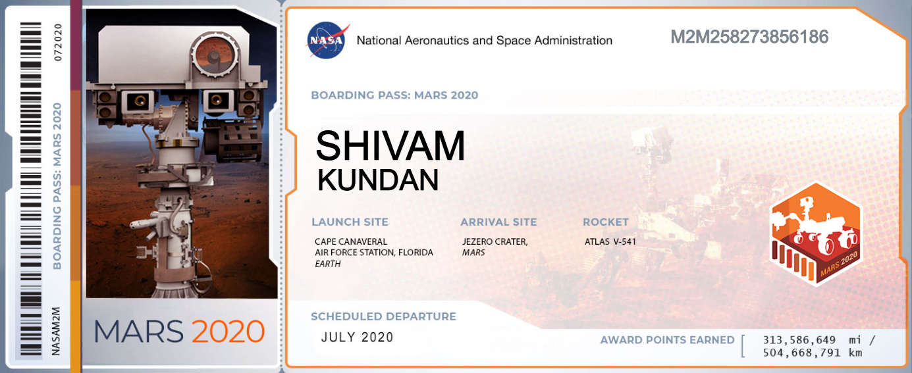

# NASA-Name-on-Mars
My name on NASA's Mars Perseverance rover (2020)

## Boarding Pass

'Boarding pass' for sending my name to Mars. All names are etched on a microchip placed on NASA's Perseverance rover launched in 2020. 

## Frequent Flier 

## Future Missions
Send your name to Mars in a future mission: https://mars.nasa.gov/participate/send-your-name/future